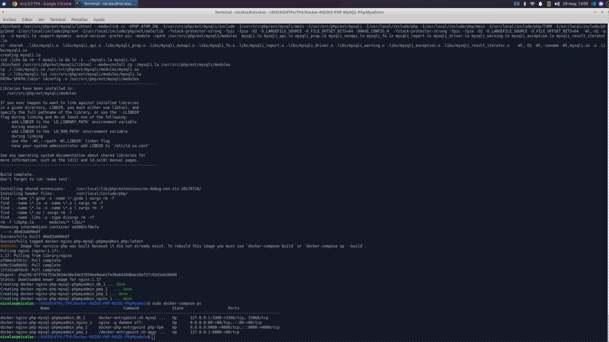
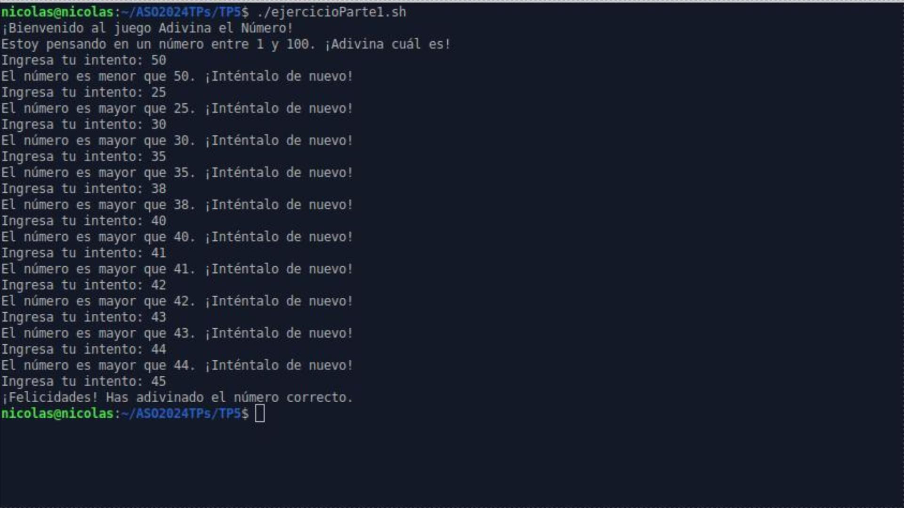
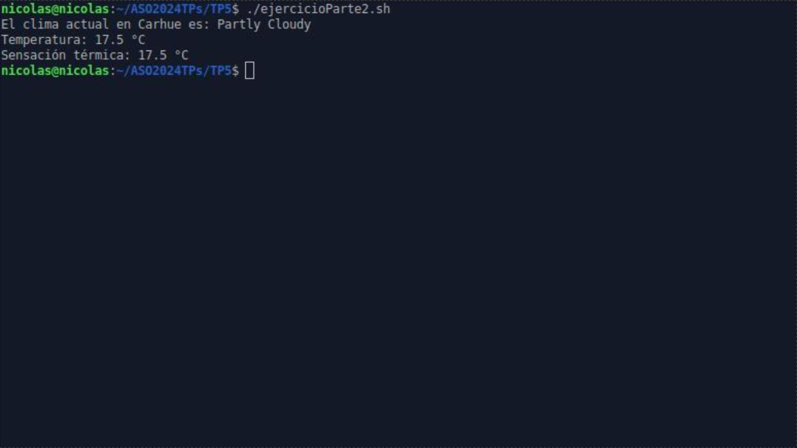

# Arquitectura de sistemas operativos 2024 UTN
## TP1
1- Preparación del sistema:

- Antes de comenzar, es importante realizar una copia de seguridad de todos los datos importantes en el sistema, ya que la instalación de un dual boot implica modificar las particiones del disco.

2- Descarga de la imagen ISO de Xubuntu:

- Se descargó la imagen ISO de Xubuntu 22.04 LTS desde el sitio web oficial.

3- Creación de una unidad USB de arranque:

- Se creó una unidad USB de arranque utilizando la imagen ISO descargada y una herramienta como Rufus (en Windows) o Etcher (en Linux).

4- Configuración del BIOS/UEFI:

- Antes de instalar Xubuntu, se accedió a la configuración del BIOS o UEFI de la computadora para asegurarse de que el arranque desde USB esté habilitado como opción de inicio prioritaria.

5- Instalación de Xubuntu:

- Se inició el sistema desde la unidad USB de arranque y se siguió el proceso de instalación de Xubuntu.
Durante la instalación, se seleccionó la opción de instalar junto a otro sistema operativo existente.

6- Configuración del dual boot:

- Después de la instalación, se reinició el sistema y se configuró el gestor de arranque GRUB para mostrar la opción de seleccionar entre Xubuntu y el sistema operativo preexistente (por ejemplo, Windows).
Se comprobó que el dual boot funcionara correctamente, permitiendo elegir entre los sistemas operativos durante el arranque.

7- Configuración de Xubuntu:

- Se realizaron ajustes adicionales en Xubuntu según las preferencias del usuario, como la configuración del idioma, la red, las actualizaciones del sistema, etc.

8- Descarga e instalación de Visual Studio Code (VSCode):

- Se utilizó el navegador web para descargar el paquete instalador de VSCode desde el sitio web oficial.
Una vez descargado, se procedió a la instalación de VSCode en Xubuntu.

9- Creación de un programa "Hola mundo" en Python:

- Se abrió VSCode en Xubuntu, se creó un nuevo archivo con extensión .py y se escribió un programa simple "Hola mundo" en Python.

10- Finalización y entrega del trabajo práctico:

- Se tomó una captura de pantalla de VSCode con el código Python y se entregó en la plataforma de aprendizaje virtual designada.

 
---
## TP2
### 1. Conceptos básicos de Linux

- Linux es un sistema operativo de código abierto mantenido por una comunidad de desarrolladores.
- El usuario "root" tiene privilegios elevados, mientras que los usuarios normales tienen permisos limitados.
- Los datos de los usuarios se encuentran en `/home/<nombreusuario>`.

### 2. Algunos comandos BASH

- Se utilizaron varios comandos de BASH como `ls`, `cd`, `mkdir`, `pwd`, `./` y `sudo` para realizar tareas como navegar por directorios, crear carpetas, ejecutar archivos, etc.

### 3. Instalación de GCC (GNU C Compiler)

- Se instaló GCC en Linux utilizando el gestor de paquetes APT con el comando:

sudo apt install gcc

### 4. Instalación de Git

- Se generó un usuario en GitHub y se instaló Git en Linux con el comando:
- sudo apt install git
- Se siguió la guía para generar un Personal Token en GitHub para autenticación.

### 5. Conceptos básicos de Git

- Se explicó el control de versiones con Git y cómo configurarlo globalmente con el correo electrónico y el nombre de usuario.
- Se mencionaron algunos comandos básicos de Git como `git init`, `git add`, `git commit`, `git clone` y `git push`.

### 6. Creando el primer repositorio con GitHub

- Se creó un repositorio público vacío en GitHub llamado `ASO2024TPs`.
- Se clonó el repositorio en el sistema local y se agregó un directorio llamado `TP2` con un archivo `procesos.c`.

### 7. Compilado del programa `procesos.c`

- Se compiló el archivo `procesos.c` utilizando GCC con el comando:
- gcc -o <nombre_archivodestino> procesos.c

### 8. Ejecución del programa compilado

- Se ejecutó el archivo binario generado con el comando:
- ./<nombre_archivodestino> &

### 9. Listado de procesos corriendo

- Se utilizó el comando `ps` para ver los procesos en ejecución y sus IDs.

### 10. Captura de pantalla

- Se tomó una captura de pantalla de la terminal utilizando la tecla "print screen".

### 11. Git push del TP2

- Se añadieron los cambios a Git con `git add`, se realizó un commit y se hizo un push al repositorio remoto en GitHub.

### 12. Entrega del TP2

- Se proporcionó la dirección del repositorio de GitHub en un archivo de texto llamado `entrega.txt` para la entrega del trabajo práctico.

---
## TP3
### Resumen del Trabajo Práctico N°3
**Tecnologias utilizadas**

|  |  |  |  |  |
|:--------------------------------------------------------------------------------------------------------------------:|:----------------------------------------------------------------------------------------------------------------:|:-------------------------------------------------------------------------------------------------------------------:|:----------------------------------------------------------------------------------------------------------------------:|:-----------------------------------------------------------------------------------------------------------------------:|
|                                                      Python                                                          |                                                            C                                                           |                                                           Ubuntu                                                          |                                                             Git                                                          |                                                            GitHub                                                         |

#### 1) Ejecución y análisis de códigos Python:

- Se ejecutaron los códigos `sinhilos.py` y `conhilos.py` varias veces para observar el tiempo de ejecución.
  - Se analizó la predictibilidad del tiempo de ejecución.
- Se compararon los tiempos de ejecución con un compañero para determinar si son iguales.
- Se realizó un experimento con el archivo `suma_rasta.py`, ejecutándolo varias veces antes y después de descomentar ciertas líneas de código para observar los efectos en el resultado.
  - Se registraron los cambios observados y se explicó la razón detrás de ellos en el archivo `README.md` del repositorio de GitHub.

#### 2) Problema de distribución equitativa de hamburguesas:

- Burger Robot, una empresa multinacional de software, tiene problemas con un algoritmo para repartir hamburguesas de manera equitativa entre los comensales.
- Se recibió asistencia del Hacker Ruso BinaryBorinsky78, cuyo código estaba encriptado y desorganizado.
- Se resolvió el enigma colocando las líneas de código en los lugares adecuados para resolver el problema de distribución equitativa de hamburguesas.
- Se proporcionó una representación gráfica del problema de las hamburguesas con 2 comensales y 8 hamburguesas.
- Se subió el código funcional del problema de distribución de hamburguesas junto con la imagen representativa a un repositorio en GitHub y se mostraron en el archivo `README.md`.

### 1-a ¿Qué se puede notar con respecto al tiempo de ejecución? ¿Es
predecible?

Los tiempos de ejecución difieren entre utilizar hilos y 
no utilizarlos. Con hilos, las tareas pueden ejecutarse 
simultáneamente, lo que resulta en un tiempo total de ejecución más corto 
en comparación con la ejecución secuencial sin hilos. En promedio, 
en 10 ejecuciones, los tiempos fueron de aproximadamente 
4.0262633 segundos con hilos  
5.1820766 segundos sin hilos.

La diferencia de tiempo se debe a que, con hilos, mientras una tarea
está en espera, otras tareas pueden continuar ejecutándose.
 

### 1-b Comparar con un campañero el tiempo de ejecución. ¿Son iguales?

Comparando con otro estudiante, sus tiempos fueron: 
alrededor de 
4.07101 segundos con hilos 
5.17174 segundos sin hilos. 
Estos tiempos validan la ventaja de utilizar hilos para
 tareas que pueden ejecutarse en paralelo, lo que lleva a una menor duración 
total del proceso.

### 1-c-Ejecutar el archivo suma_rasta.py unas 10 veces, luego descomentar(borrar el #) las líneas 11,12,19 y 20 guardarlo y ejecutarlo otras 10veces. ¿Qué pasó? ¿Por qué?
El programa consiste en dos hilos que se ejecutan en paralelo: uno realiza sumas y el otro restas. Ambos hilos utilizan una variable global llamada acumulador, que representa una zona crítica. Los hilos compiten por acceder y modificar este recurso compartido sin ningún tipo de control de concurrencia, lo que provoca una condición de carrera.

La intención es que, al final de la ejecución de ambos hilos, el valor de acumulador sea cero. Sin embargo, debido a la condición de carrera, se obtienen valores incorrectos. Esto ocurre porque ambos hilos están accediendo y modificando la variable global simultáneamente sin ninguna sincronización, lo que lleva a resultados inconsistentes.

Cuando se descomentan ciertas líneas de código, un hilo entra en un bucle de 1000 iteraciones antes de que el otro hilo comience su ejecución. Este retraso hace que la condición de carrera (race condition) sea más visible, pero el problema subyacente persiste  si esas lineas estan descomentadas. La falta de control sobre el acceso concurrente a la variable global provoca errores en el valor final de acumulador.

### 2-a.
<a href="./TP3/hamburguesas-corregido.c">puzzle resuelto</a>
#### explicacion de cambio de turno 
-un cambio de turno lo puse antes de salir de la zona critica. Lo hice asi para que cuando un hilo come una hamburguesa deba pasar al otro turno para que pueda entrar en la seccion critica y comer una hamburguesa.                                                                            
-si no quedan hamburguesas entra al else, alli pongo el cambio de turno y paso al turno siguiente para que no se quede en un bucle infinito mirando la bandeja vacia

### 2-b Viendo la figura como sería para el problema de las hamburguesas con 2 comensales y 8 hamburgesas.

 

## TP4
### Resumen del Trabajo Práctico N°4

El trabajo práctico consistió en configurar servicios web básicos usando Docker Compose y clonar parcialmente un sitio web. Se clonó un repositorio, se arrancaron los servicios, se accedió a ellos a través del navegador y se clonó el sitio de la facultad. Se tomaron capturas de pantalla como evidencia y se entregaron en un repositorio.

### 4-a.

- Luego de clonar el repositorio, mostrar
con captura de pantalla la creación de los servicios y que los servicios están corriendo vía docker-compose ps.

### 4-b.
- Mostrar los sitio que crean los servicios phpmyadmin y
nginx con capturas de pantalla de un navegador web.

### 4-c.

- Luego de clonar el sitio de la facultad, mostrar que está corriendo en forma local

## TP5
### Resumen del Trabajo Práctico N°5
El Trabajo Práctico Nº 5 de Bash scripting consta de ocho partes que abordan diferentes ejercicios para practicar el uso de scripts en Bash. Estos ejercicios van desde la creación de juegos simples como "Adivina el Número" y "Piedra, Papel o Tijeras", hasta la implementación de herramientas útiles como una calculadora simple y un contador de palabras en archivos de texto. Además, incluye tareas más avanzadas como el uso de APIs para obtener información del clima actual de una ciudad y determinar el género y la edad probable de un nombre ingresado por el usuario mediante consultas a servicios web externos. Este práctico proporciona una variedad de desafíos para desarrollar habilidades en scripting de Bash y trabajar con APIs.

### paso a paso
 1 instalar 
- sudo apt-get install curl jq

2 crear un archivo sh 
- nano ejercicioParte1.sh 

3 escribir codigo bash

4 guardar y salir

- ctrl + o (luego enter)
- ctrl + x (salir)

5 agregar permisos ejecutable 
- chmod +x ejercicioParte1.sh

6 ejecutar el programa
- ./ejercicioParte1.sh

### parte 1 - adivina el numero

### parte 2 - clima en carhue

